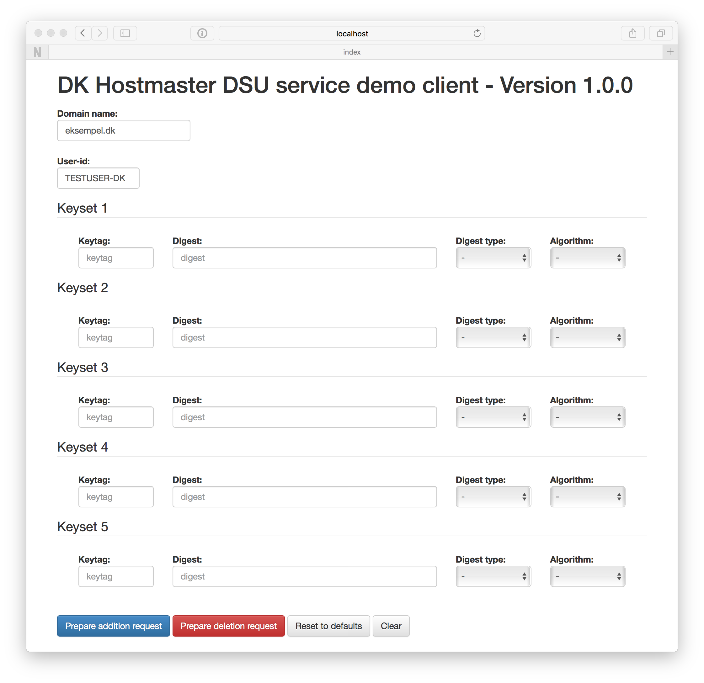

# NAME

DK Hostmaster DSU service demo client

# VERSION

This documentation describes version 1.1.1

# INTRODUCTION

This is a pretty basic client for demonstrating DK Hostmaster's DSU protocol.

The protocol is a HTTP based API for uploading and deleting DS keys for a given domain for the .dk registry administered by DK Hostmaster A/S.

The client is intended for demonstration and does not validate entered data in order to be able to demonstrate error scenarios as well as expected use.

The client is implemented in Perl using the Mojolicious framework (see dependencies below).

# USAGE

    $ morbo -l https://*:5000 client.pl

Open your browser at:

    https://localhost:5000/

# Using `docker`

The application can be used using `docker`

    $ docker build -t dsu-demo-client .

    $ docker run --rm -p 5000:5000 --name dsu-demo-client dsu-demo-client

Open your browser at:

    https://localhost:5000/

# DEPENDENCIES

This client is implemented using Mojolicious::Lite in addition the following
Perl modules are used all available from CPAN.

- [Readonly](https://metacpan.org/pod/Readonly)
- [Mojo::UserAgent](https://metacpan.org/pod/Mojo::UserAgent)

In addition to the Perl modules, the client uses [Twitter Bootstrap](http://getbootstrap.com/) and hereby jQuery. These are automatically downloaded via CDNs and are not distributed with the client software.

# SEE ALSO

The main site for this client is the Github repository.

- https://github.com/DK-Hostmaster/dsu-demo-client-mojolicious

For information on the service, please refer to service page with
DK Hostmaster.

- https://www.dk-hostmaster.dk/en/dsu

Or the DSU specification:

- https://github.com/DK-Hostmaster/dsu-service-specification

# COPYRIGHT

This software is under copyright by DK Hostmaster A/S 2015-2016

# LICENSE

This software is licensed under the MIT software license

Please refer to the LICENSE file accompanying this file.
